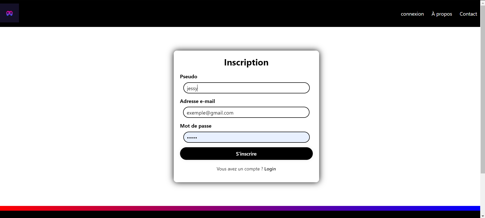
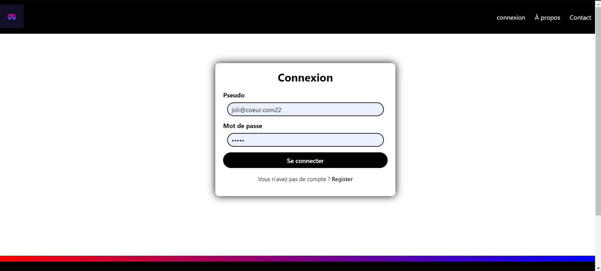
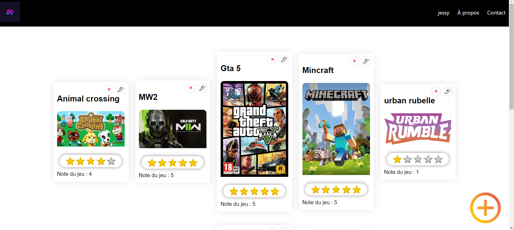
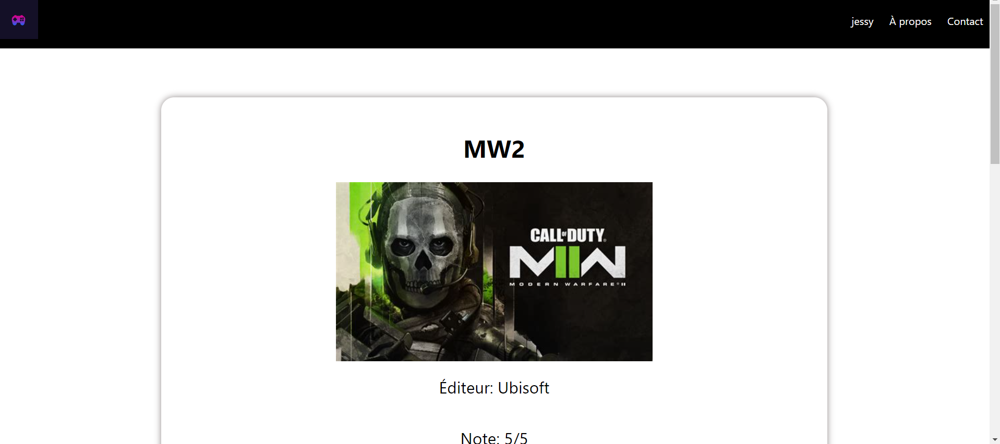
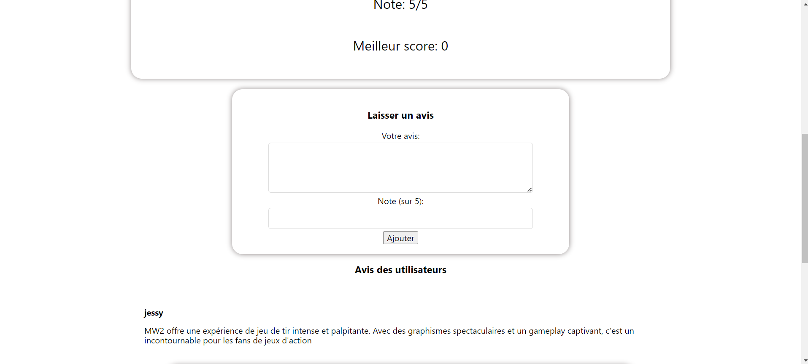
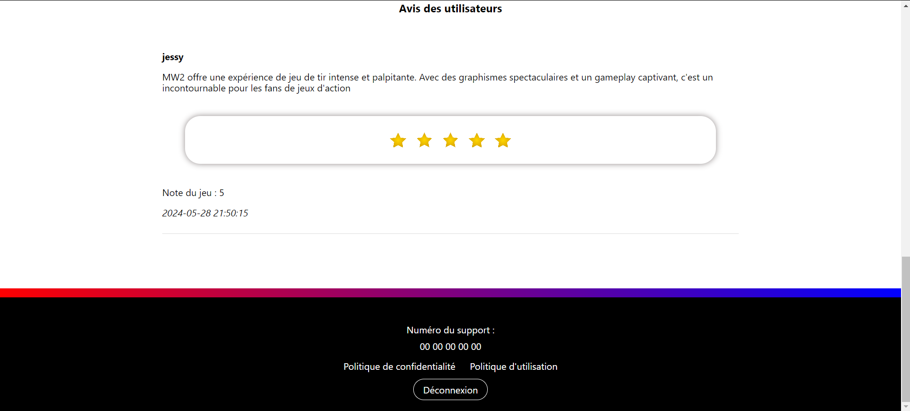

# Rapport de Projet

## But du Projet
Le but de notre projet était de créer un site web permettant de communiquer avec une base de données MySQL/MariaDB, hebergé comme nous le souhaitons. Ce site web devait afficher les éléments que les personnes ajoutent sur le site, ces données sont stocké dans la base de données.

## En quelque images






## Cadre de Développement
- **Établissement** : École d'informatique
- **Niveau d'études** : Première année (B1)
- **Contraintes** :
  - Nombre de cours alloués : 7 cours (28 heures)
  - Temps réellement disponible : 2 cours (8 heures) en raison de problèmes de réseau empêchant la communication entre deux machines virtuelles (VM).
  - Travail en binôme

## Stack Technique
- **Langage** : PHP
- **Base de données** : MariaDB (via phpMyAdmin, fourni par XAMPP)

## Installation du Projet
Une fois le ripo cloné, suivez les étapes ci-dessous :

1. **Pré-requis** : Assurez-vous d'avoir XAMPP, Wamp ou bien un hebergement disposent de mysql et apache.

2. **Création de l'utilisateur et de la base de données** :
   - Accédez à vôtre gestionnaire de base de donnée (phpMyAdmin).
   - Créez un nouvel utilisateur et assignez les privilèges nécessaires.
   - Importer la base de données "sc1feir2687_infrastructure.sql" du dossier Data_Base .

3. **Configuration des Crédentiels** :
   - Créez un fichier `credentials.php` dans le répertoire de votre projet avec le contenu suivant :
     ```php
     <?php
         $serveur = "localhost";
         $utilisateur = "Votre nom d'utilisateur";
         $mot_de_passe = "Son mdp";
         $base_de_donnees = "Le nom de votre base de données";
     ?>
     ```
   - Remplacez `"Votre nom d'utilisateur"`, `"Son mdp"`, et `"Le nom de votre base de données"` par les informations appropriées.

4. **Déploiement** :
   - Assurez-vous que le serveur Apache et MySQL sont démarrés.
   
5. **Accès à l'application** :
   *En Local* :
   - Ouvrez un navigateur web et accédez à `http://localhost/nom_de_votre_projet` pour voir votre application en action.
   
   *En ligne*:
   - Ouvrez un navigateur web et tappez votre nom de domaine où est mis votre site et base de donnée. 

Cette configuration simple permet de connecter votre application PHP à une base de données, facilitant ainsi le développement et le test local de votre projet.

## Conclusion
Malgré les contraintes de temps et les défis techniques rencontrés, notamment les problèmes de réseau entre les VM, nous avons réussi à établir une base de communication entre PHP et une base de donnée, démontrant ainsi notre capacité à surmonter les obstacles et à travailler efficacement en équipe.

Pour toute question ou clarification, n'hésitez pas à nous contacter directement via l'onglet contacte une fois connecter et votre page en ligne.
